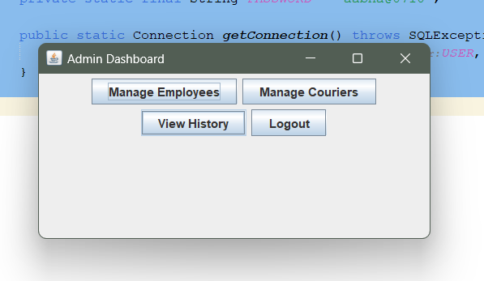
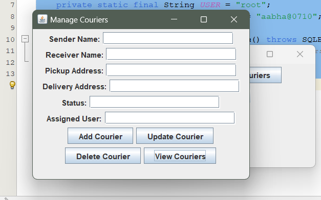

# 📦 Courier Management System

A desktop application for managing courier operations — built with **Java**, **MySQL**, and **JDBC**. Supports two roles: **Admin** and **User (Branch Staff)**, each with their own dashboard and permissions.

---

## What it does

- Admin can manage employees and couriers, and view deletion history
- Users can add new couriers and track them by ID
- Passwords are hashed with BCrypt for secure login
- Deleted records are automatically archived using MySQL triggers
- Real-time status tracking with unique courier IDs generated on order placement

---

## Tech Used

- **Java + Swing** — UI and application logic
- **MySQL** — database storage
- **JDBC** — connects Java to MySQL
- **BCrypt** — password hashing
- **NetBeans** — development environment
- **MySQL Workbench** — database design and management

---

## Database

The `courier_management` database has 5 tables:

- `users` — login credentials and roles
- `couriers` — all parcel/courier records
- `employees` — employee details
- `previous_couriers` — archived deleted couriers (via trigger)
- `previous_employees` — archived deleted employees (via trigger)

---

## How to Run

1. Clone the repo and open it in **NetBeans**
2. Set up MySQL and run the SQL below to create the database
3. Update your credentials in `DBConnection.java`
4. Add `mysql-connector.jar` and `jbcrypt.jar` to project libraries
5. Clean, Build and Run
```sql
CREATE DATABASE courier_management;
USE courier_management;

CREATE TABLE users (
    id INT AUTO_INCREMENT PRIMARY KEY,
    username VARCHAR(50) UNIQUE,
    password VARCHAR(100),
    role ENUM('admin', 'user') NOT NULL
);

CREATE TABLE couriers (
    id INT AUTO_INCREMENT PRIMARY KEY,
    sender_name VARCHAR(100),
    receiver_name VARCHAR(100),
    pickup_address VARCHAR(255),
    delivery_address VARCHAR(255),
    status VARCHAR(50),
    assigned_user VARCHAR(50),
    created_at TIMESTAMP DEFAULT CURRENT_TIMESTAMP
);

CREATE TABLE employees (
    id INT AUTO_INCREMENT PRIMARY KEY,
    name VARCHAR(100),
    position VARCHAR(100),
    email VARCHAR(100),
    phone VARCHAR(15),
    created_at TIMESTAMP DEFAULT CURRENT_TIMESTAMP
);

CREATE TABLE previous_employees (
    id INT PRIMARY KEY,
    name VARCHAR(100),
    position VARCHAR(100),
    email VARCHAR(100),
    phone VARCHAR(15),
    deleted_at TIMESTAMP DEFAULT CURRENT_TIMESTAMP
);

CREATE TABLE previous_couriers (
    id INT PRIMARY KEY,
    sender_name VARCHAR(100),
    receiver_name VARCHAR(100),
    pickup_address VARCHAR(255),
    delivery_address VARCHAR(255),
    status VARCHAR(50),
    deleted_at TIMESTAMP DEFAULT CURRENT_TIMESTAMP
);
```
```java
// DBConnection.java
private static final String URL = "jdbc:mysql://localhost:3306/courier_management";
private static final String USER = "root";
private static final String PASSWORD = "your_password_here";
```

## Screenshots

### Login


### Admin Dashboard


### Manage Couriers

