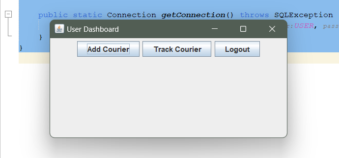
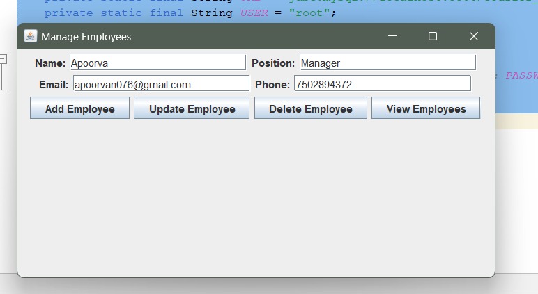
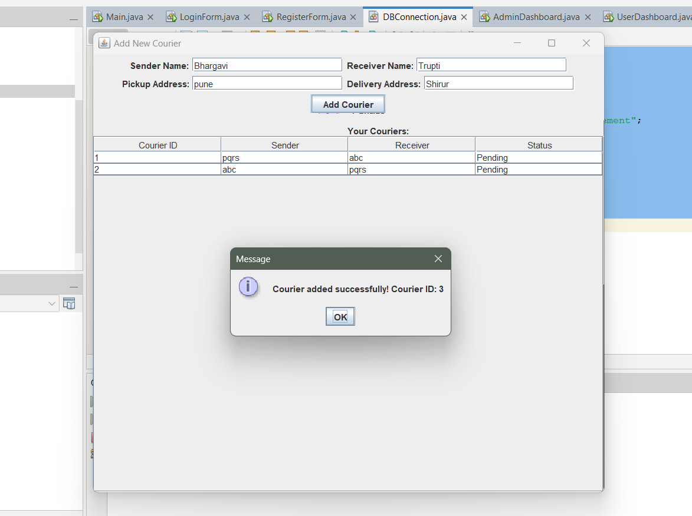

# 📦 Courier Management System

A desktop-based courier operations management system built using **Java Swing, JDBC, and MySQL**. The application provides secure authentication, role-based access control, courier tracking, employee management, and automated database auditing through MySQL triggers.

---

## 🚀 Key Features

### 🔐 Secure Authentication
- User login system with **BCrypt password hashing**
- Prevents storage of plaintext passwords
- Supports role-based authorization

### 👥 Role-Based Access Control (RBAC)

#### Admin
- Manage employees
- Manage couriers
- View archived records
- Monitor courier operations

#### Branch Staff (User)
- Add new courier orders
- Track courier status
- Update courier information

### 📦 Courier Tracking System
- Unique courier IDs generated automatically
- Real-time courier status tracking
- Sender and receiver information management

### 🗃️ Employee Management
- Add, update, delete, and manage employee records
- Centralized employee database

### 📜 Automated Audit Trail
- Deleted employees and couriers are automatically archived
- Implemented using MySQL Triggers
- Preserves historical records for accountability and recovery

---

## 🏗️ System Architecture

```text
Java Swing UI
      │
      ▼
Business Logic Layer
      │
      ▼
JDBC Data Access Layer
      │
      ▼
MySQL Database
      │
      ├── Users
      ├── Couriers
      ├── Employees
      ├── Previous Couriers
      └── Previous Employees
```

---

## 🛠️ Technology Stack

| Layer | Technologies |
|---------|------------|
| Frontend/UI | Java Swing |
| Backend Logic | Java |
| Database Connectivity | JDBC |
| Database | MySQL |
| Security | BCrypt |
| Development Environment | Apache NetBeans |
| Database Management | MySQL Workbench |

---

## 🧠 Engineering Highlights

### Database Auditing
Implemented MySQL triggers to automatically archive deleted employee and courier records.

### Secure Authentication
Integrated BCrypt hashing to protect user credentials and eliminate plaintext password storage.

### Role-Based Authorization
Created separate dashboards and permissions for administrators and branch staff.

### Relational Database Design
Designed a normalized database schema with dedicated tables for users, couriers, employees, and archived records.

---

## 🗄️ Database Schema

The `courier_management` database contains the following tables:

- `users` — login credentials and user roles
- `couriers` — courier and parcel records
- `employees` — employee information
- `previous_couriers` — archived deleted courier records
- `previous_employees` — archived deleted employee records

---

## ⚙️ How to Run

### 1. Clone the Repository

```bash
git clone https://github.com/bhargavi0710/CourierManagementSystem.git
cd CourierManagementSystem
```

### 2. Create the Database

```sql
CREATE DATABASE courier_management;
USE courier_management;

CREATE TABLE users (
    id INT AUTO_INCREMENT PRIMARY KEY,
    username VARCHAR(50) UNIQUE,
    password VARCHAR(100),
    role ENUM('admin', 'user') NOT NULL
);

CREATE TABLE couriers (
    id INT AUTO_INCREMENT PRIMARY KEY,
    sender_name VARCHAR(100),
    receiver_name VARCHAR(100),
    pickup_address VARCHAR(255),
    delivery_address VARCHAR(255),
    status VARCHAR(50),
    assigned_user VARCHAR(50),
    created_at TIMESTAMP DEFAULT CURRENT_TIMESTAMP
);

CREATE TABLE employees (
    id INT AUTO_INCREMENT PRIMARY KEY,
    name VARCHAR(100),
    position VARCHAR(100),
    email VARCHAR(100),
    phone VARCHAR(15),
    created_at TIMESTAMP DEFAULT CURRENT_TIMESTAMP
);

CREATE TABLE previous_employees (
    id INT PRIMARY KEY,
    name VARCHAR(100),
    position VARCHAR(100),
    email VARCHAR(100),
    phone VARCHAR(15),
    deleted_at TIMESTAMP DEFAULT CURRENT_TIMESTAMP
);

CREATE TABLE previous_couriers (
    id INT PRIMARY KEY,
    sender_name VARCHAR(100),
    receiver_name VARCHAR(100),
    pickup_address VARCHAR(255),
    delivery_address VARCHAR(255),
    status VARCHAR(50),
    deleted_at TIMESTAMP DEFAULT CURRENT_TIMESTAMP
);
```

### 3. Configure Database Connection

Update database credentials in:

```java
// DBConnection.java
private static final String URL =
    "jdbc:mysql://localhost:3306/courier_management";

private static final String USER = "your_username";
private static final String PASSWORD = "your_password";
```

### 4. Add Required Libraries

Add the following JAR files to your NetBeans project:

- mysql-connector-j
- jbcrypt

### 5. Run the Application

```text
Open project in NetBeans
Clean Project
Build Project
Run Project
```

---

## 📸 Screenshots

### Admin Dashboard


### User Dashboard


### Manage Couriers


### Manage Employees


### Add Courier


---

## 🔮 Future Enhancements

- QR-code based parcel tracking
- SMS and email notifications
- Shipment route optimization
- Analytics and reporting dashboard
- REST API integration
- Web-based version of the system
- Multi-branch courier management

---

## 👩‍💻 Author

**Bhargavi Jagdale**

B.E. Computer Engineering, MMCOE Pune

- GitHub: https://github.com/bhargavi0710
- LinkedIn: https://www.linkedin.com/in/bhargavi-jagdale-a29b69290

---

## 📄 License

MIT License — free to use and modify.
